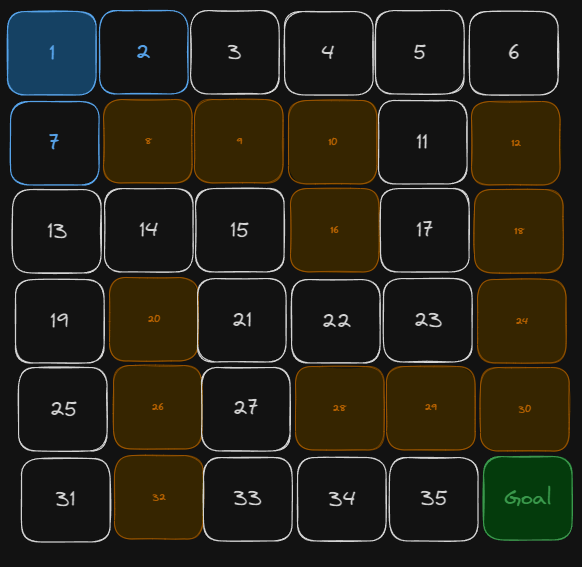
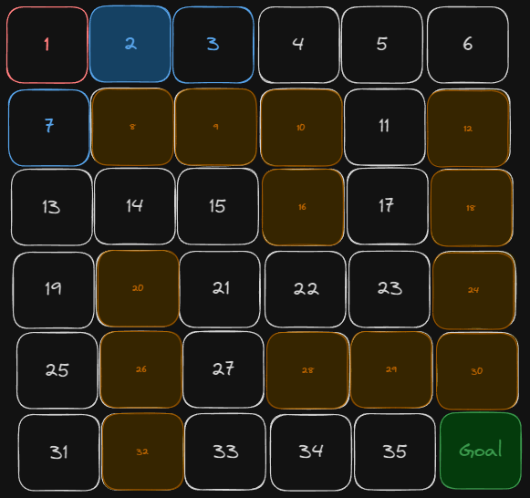
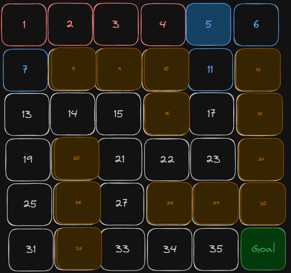

# Chapter 5 Constant Time Storage and Access

## 5.1 Introduction 
Have you ever wondered how variables are handled in your applications and operating systems? By now you should be familiar with terms like the Stack and the Heap and have a general idea of what type of data gets stored in these two places.

In this chapter, we will focus on how memory works within our applications so that we can better manage it in our algorithms. We will take a look at how we can predict the memory usage of our code, and optimise the memory usage to achieve constant memory usage, we will also take a look at how we can ensure constant time access to data within our algorithms.

The knowledge gained in this section will allow you to write more efficient algorithms in your day-to-day programming and also allow you to pass interview questions that require constant storage usage.
## 5.2 The Role of Memory in Applications
Before looking at how data works in the context of an algorithm, we need to look at how memory works in our systems.

To keep things fairly straightforward, we won't go into the full complexity of how the operating system handles memory, but only the key details for you as a programmer.

Throughout this chapter, the word memory will be used, in computing terms, memory usually refers RAM (Random Access Memory), so any mention of memory will directly translate to RAM.

#### 5.2.1 OS Level Memory Allocation
The operating system (OS) will dynamically allocate memory to each application to prevent a few issues like different applications trying to access the same memory locations and also prevent applications from crashing due to low memory availability.

If you have ever looked at the resource usage on your machine, you might have noticed that when you have one memory-intense application running and open another, the first application's memory usage dips, this is not because it suddenly became efficient on memory, but this is the OS managing the available space.

#### 5.2.2 Application Level Memory Allocation
The operating system is not the only thing that places restrictions on the amount of memory that our applications can access, the runtime also restricts our resource usage.

You might have noticed that your applications only use a fraction of the available resources even when trying to perform operations that are intense.

Each programming language's runtime will limit the amount of CPU and memory that can be used, this can be tweaked but requires a bit of tinkering.

## 5.3 Stack and Heap
The stack and the heap allow us to use the memory that has been allocated to our applications, understanding the way they work is the first step to writing more efficient code.
  
#### 5.3.1 Stack Allocation 
When you create a variable in your application, you are creating a new item in the stack, the stack stores the values of primitive data types (char, ints, floats, booleans etc), and keeps a reference to all other data types allowing us access to the data that we need in our code. We usually refer to these two types of data as `value` types and `reference` types.

The stack is also used for storing references to active functions, this is often referred to as the call stack, once the functions are done executing, they will be removed from the stack.

Stack memory is the best kind of memory, this memory is preallocated by the application runtime and reserves contiguous memory (memory addresses that are directly next to each other), this not only makes addressing values in the stack faster, but it also allows the OS to cache the data, making memory access even faster.

Although we only get a few megabytes in the stack, the type of data we store and the limited ability to write values directly to the stack makes it very hard to run out of memory. The most common way to run out of stack space would be through the call stack when we have an infinite recursive call, this will result in a StackOverflow Error.
#### 5.3.2 Heap Allocation 
The heap is a dynamic memory store, unlike the stack, the memory that is allocated to the application isn’t actively used when the application starts, but will increase and decrease as objects are created and destroyed. 

The heap stores the objects that are referenced in the stack but in situations where value types are stored in reference types, those values will also be stored in the heap.

Heap storage is usually provided based on the total resources in the system, each application will have a percentage of usable memory if this limit is exceeded, a MemoryError will be produced.

#### 5.3.2.1 Garbage collector
To help protect against MemoryError, we have the garbage collector. As the name suggests, it clears garbage in our heap.

The garbage collector clears objects that are not being referenced anymore, whenever a variable that stores an object is overwritten, the old object doesn’t automatically disappear, it will remain in the heap until the garbage collector is invoked.

The garbage collector is invoked after a certain number of objects are left lingering and when it's invoked, it causes all other operations to stop until the process is done. So for the benefit of performance, we want to limit the amount of times that the garbage collector is invoked.

## 5.5 Space Complexity 
Now that we know how memory works within our applications, we can learn how to measure the memory usage in our applications.

Space complexity is a way to measure the amount of additional memory an algorithm uses while running, we measure this complexity using the Big O notion similar to the time complexity, but unlike time complexity, we can't use the RAM model to get an initial equation to measure the performance.

To get an equation that we can use to create our Big O assessment, we can use the `S(P) = c + Sp` equation which looks at the fixed part and the variable parts of our algorithm.
### 5.5.1 Fixed Part 
The fixed part will be any variable that’s not dependent on the input size and will use a fixed amount of memory every time the algorithm is run.

*fp-01*
```python 
def add_first_and_last_index(values: list):
	first_value = values[0] # 1 allocation
	last_value = values[-1] # 1 allocation

	return first_value + last_value
```

In the code *fp-01*, we are creating two variables, `first_value` and `last_value`, we can clearly see that we will only ever use a single memory allocation as they both store a single fixed size value, and if the `values` list grew to 10000, the allocation would not be affected.

*fp-02*
```python
def sum_values(values: list):
	final_output = 0 # 1 allocation

	for i in range(len(values) - 1):
		first_value = values[i] # 1 allocation
		second_value = values[i + 1] # 1 allocation

		final_output += first_value + second_value # 0 - value is being updated

	return final_output
```

The code *fp-02* might be misleading to some based on the knowledge of the RAM model, but it's for this exact reason that we don't apply the RAM model to memory access. As long as we are using the same variable name, we will continue to have a single memory allocation per variable, space complexity focuses on the change in allocation based on the input.

Although reassigning reference types would result in objects with no references in the heap, we don’t count that towards our space complexity, but we would keep those operations in mind when accounting for garbage collection.
### 5.5.2 Variable Part
The variable part, as the name suggests, is dependent on something. Any variables whose memory usage changes based on the input that is passed will be variable. When formulating our equation, the variable part will produce our `n`.

*vp-01*
```python 
def reverse_list(values: list):
    output = []

    for i in range(1, len(values) + 1):
        index = -i
        output.append(values[index]) # n allocations

    return output
```
In the code *vp-01*, we are trying to reverse a list, we have declared a list `output` which will store the final order of our items.

We can see that the size of `output` is directly dependent on the size of `values` so we can safely say that `output` will have an O(n) space complexity.

### 5.5.3 The Equation 
*EQ-01*
```python 
def reverse_list(values: list):
    output = [] # Fixed Part

    for i in range(1, len(values) + 1): # Fixed Part
        index = -i # Fixed Part
        output.append(values[index]) # Variable Part

    return output
```

- `output = []` - 1 allocation 
	- If the list contains 0 or 1000 items, this memory will always be allocated
- `i in range(values)` - 1 allocation 
	- `i` is a variable, it's value will be updated after each iteration
- `index = -1`  - 1 allocation 
	- `index` will be updated after each iteration
- `ouput.append(index)`: n allocations 
	- We are looping through `value` which will be out `n`
	- For each iteration of the loop, we append to `output`

Our final equation will look something like this: 
`1 + 1 + 1 + n`
`S(P) = 3 + n`

If you think back to how the RAM model is converted into Big O, you should be able to see the space complexity of this algorithm in relation to Big O, it will be O(n).

*EQ-02*
```python 
def reverse_list(values: int):
    left = 0
    right = len(values) - 1

    while (left < right):
        temp = values[left]
        values[left] = values[right]    
        values[right] = temp

        left += 1
        right -= 1

    return values
```

By using more fixed part variables, we are able to optimise our space usage.
- `left` - 1 Allocation 
	- Stores a value type that gets updated
- `right` - 1 allocation 
	- Stores a value type that gets updated
- `temp` - 1 allocation 
	- Stores a single value every time 
- `values[left] = values[right]` - 0 allocations 
	- Uses the existing space in the list to update the value at the position 
- `values[right] = temp` - 0 allocations 
	- Uses the existing space in the list to update the value at the position 


From this, we would get an equation of `S(P) = 3 + 0` since we have no variable parts, translating to Big O, we would have an O(1) space complexity.

You might have also noticed that the time complexity would also be better, if we were to use the RAM model on this code, you would find that the fastest growing term in this code is O(1/2n), which would still translate to O(n) in Big O terms, but the less generalized RAM model tells us that the code is more efficient.
### 5.5.4 Recursion 
Earlier in this chapter, we talked about the call stack and how all of the functions that are active will be in the call stack until they are done with their operations.

When it comes to recursion, we know that every function that we call will exist until we the base case is met and all of the subsequent functions will end.

*RE-01*
```python 
def reverse_list_and_values(values: list):

    if len(values) == 0:
        return []    

    new_value = []

    for i in range(1, len(values[0]) + 1):
        index = -i
        new_value.append(values[0][index])

    return reverse_list_and_values(values[1::]) + ["".join(new_value)]
```

The function *RE-01* takes in a list of strings and reverses both the outer list and characters in the string.

To determine the space complexity of this operation, we can start off by looking a the space complexity of the normal operations. You might notice that this code is very much the same `3 + n` space complexity that we looked at for *EQ-01*, we declare the `new_value` list and inside our loop, we are adding values from the `values[0]` list to our `new_value`. We also have a few other fixed part variables `i` and `index` within our loop.

To get the space complexity of the recursion, we need to firstly look at the relationship between our recursive call and our input, if we treat `values` as our `n`, we can see that the recursion ends when `n` has a length of 0, and looking at our recursive implementation `reverse_list_and_values(values[1::])` we can see that we are reducing the size of `n` by 1 for each iteration. For each recursive iteration, we are both adding a function to the call stack, but also adding the other operations to memory, to differentiate, we will refer to the other operations as `3 + m` where `m` is the length of the individual strings.

Our recursion will have an `n` space complexity, so we would have an equation of ` S(P) = n + n(3 + m)` since there will be `n`  `3 + m` operations being performed. We can break this up further to `3n + m*n`, we can see that the fastest growing term here will be `m*n` which would end up being our Big O, O(m*n)

Space complexity with recursion can however become much worse. We can treat the following recursion (excluding other operations) as O(n) since there is only 1 recursive call, but imagine if we had 2, we could exponentially increase the amount of space required resulting in an O(n²) before we even look at the other operations.

So overall, when measuring the space complexity of a recursive call, we want to do the following:
1. Look at the general operations to get the space complexity of the individual function
2. Look at how the input affects the depth of the recursion 
3. The space complexity will be `effect of input`^`number of recursive calls` 
	1. So if we had an O(n) for the effect of the input, and 3 recursive calls, we would have an O(n³) complexity.
4. The final equation will be `recursion complexity + recursion complexity(function complexity)`

## 5.6 Constant Time Access
The amount of space that our data takes is not our only concern, the speed at which we can access it is also really important. In an ideal world, all memory access would be constant time, but that's just not the case, there are only a few instances where this is achievable.

To have constant time memory access, the size of our collection should not affect the time it takes to perform a certain operation. Constant time access is important for algorithms that need to frequently access or reference data, you will see a lot of constant time operations in a lot of search algorithms for Graphs and Trees.

Two algorithms that lean on constant time memory access operations are the Breadth First Search (BFS) and Depth First Search (DFS), these two algorithms are used for searching graphs and trees. We will take a look at the Depth first search algorithm, but also highlight the minor differences it has with the Breadth First Search.

### 5.6.1 Searching Through a Maze
*In the following set of examples, we will be looking at how the DFS algorithm can be used to search for a given goal state, this algorithm is commonly used for AI search problems.*

If `1` is our start position and we need to find a way to `goal`, we need to use the DFS algorithm to determine whether we can reach the `goal`, we won't be looking to return an actual path, we just want to know if it's possible to read the `goal` node.



- We start off at `1`
- `2`and `7` are open moves 
- We can store our current position and possible moves in some data structures
`current_position` - 1
`possible_moves` - [2, 7]



- We take the first possible move from our `possible_moves` and that becomes our new `current_position`
- `3` is now a new possible move, we add it to the front of our `possible_moves` collection 
- Although `2` is not directly connected to `7` it will be our next path if the current path we're on leads to a dead-end.
- `1` is an open position next to `2`, but we've already visited it, we can create another variable to prevent cycles and add `1` to the collection.

`Current Position` - 2
`Possible Moves` - [3, 7]
`visited` - [1]


- Fast forward a few steps 
- We get to `5` and `6` and `11` are possible moves
- We will go to `6` next and hit a dead-end 
- We will then go to `11` when we hit that dead-end.

`Current Position` - 5
`Possible Moves` - [6, 11, 7]
`visited` - [1,2,3,4]

This is not a chapter on graphs and DFS, so we won't go any further, we have the information that we need

#### 5.6.1.1 Determining Data Types
At each step, we kept track of 3 variables `current_position`, `possible_moves` and `visited`. 

**current_position**
- The node currently being checked 
- Does not grow at each step
- Only stores a single value at a time.
- Gets updated per step.

**possible_moves**
- Stores open nodes around the current node 
- Used to determine the next `current_position`
- The last value entered will be the first value removed
- Shrinks by 1 item every step, but can insert 0 to many items per step

**visited**
- Stores the past `current_position` values 
- Grows by 1 item for each step
- Referenced to make sure that past `current_positions` aren't added to `possible_moves`

If we are not careful with the time complexity of the operations that we perform, we can have the following issues.
- `possible_moves` is dynamic and can grow very fast based on the possible moves per step. If the operations to find a position and delete a value are each O(n), the performance of our code will get worse as we perform more steps, and might get more efficient when the number of moves gets less.
- `visited` will always grow linearly, as we add more visited positions, having an O(n) search to make sure that a position hasn't been travelled will make our application run slower as we visit more nodes.

The solution for each of our variables will be the following.
**current_position**
- Any single value data type 
- We can store a value type or a reference type since we are referencing a single value 
- Reading and updating from this single value will always be constant time since we either have the actual value in the stack or a reference to the value.

**possible_moves**
- Since we are extracting the last value entered we can use a stack
- The stack will give us constant time reads and write 

**Visited**
- We need constant time lookups
- We can use a hash set which allows for constant time look ups regardless of the input size.

### 5.6.1 Importance of Constant Time Access
As shown in the previous example, we need to travel through almost every node in our maze in order to find the goal position, if we had hundreds of thousands of nodes to search, having O(n) operations for lookups and checking the next position would make our algorithm really slow.

Before looking at stacks and queues in a bit more detail, we can take a look at the constant time operations for common data structures.

| Data Structure | insertion                  | update    | retrieval | deletion   |
| -------------- | -------------------------- | --------- | --------- | ---------- |
| String         |                            |           | any index |            |
| Array          |                            | any index | any index |            |
| List           | append (insert at the end) | any index | any index | last index |
| Dictionary     | any index                  | any index | any index | any index  |
| Set            | any index                  |           | any index | any index  |
| Stack          | push                       |           | pop       | pop        |
| Queue          | enqueue                    |           | dequeue   | dequeue    |

 
#### 5.6.1.1 Stack
The stack is a LIFO (Last in first out) data structure, the last value that is inserted will be the first value to be removed. As we saw, it can be very helpful when performing a Depth First Search.

This data structure offers constant time reads and writes as we are only taking values from a single position, we we will always have a pointer to this position, allowing for constant time reads and write. 

The best approach for implementing a stack would be through a linked list where we will just keep track of the head node, as we add new items to the stack, we change the position of the root node and point to the previous root as the next node, when we want to `pop()` a value, we just change the head from the current position to the next position.

Python doesn't natively come with the stack, but we can also implement it through a list. A list in Python has constant time insertion when adding a value to the end, and constant time deletion when removing an item at the end of the list, this allows us to directly implement the stack without having to do too much work.

#### 5.6.1.2 Queue
The queue is a FIFO (First in first out) data structure, the first value that was inserted will be the first value removed.

Unlike the stack, we can't implement the queue using a list and have a constant time read and write since we would need to remove items from different positions. We can however use a linked list for this and instead of keeping track of the head only, we can keep track of the head for `dequeuing` and the tail for `enqueuing` allowing use to have constant read and write times.

Python also doesn't include this data structure out of the box, but we can use a module called `dequeue` to work with the queue.

### 5.7 Summary 
This has been a very long chapter and we have covered a lot.
- We took a look at how the operating system and programming language affect the amount of memory our applications use.
- We saw where our value and reference type variables get stored 
- We took a look at how the garbage collector cleans up our heap when we have too many unallocated objects
- We saw how to calculate the space used by an algorithm and how to optmise this space.
- We took a look at the importance of constant time access to our data 
- We looked at the stack and queue and how they allow for constant time operations 

### 5.8 Conclusion 
Now that you have a few more tools under your belt, it's time we sent you free to and explore these concepts for yourself.


## 5.9 Further Reading and Resources
1. Additional learning
 - [DFS](https://www.youtube.com/watch?v=by93qH4ACxo),
 - [BFS](https://www.youtube.com/watch?v=xlVX7dXLS64)
 - [A*](https://www.youtube.com/watch?v=i0x5fj4PqP4) 
 - [Djikstras Algorithm](https://www.youtube.com/watch?v=EFg3u_E6eHU)

2. Online Courses
- "Algorithms, Part I" and "Algorithms, Part II" by Princeton University on Coursera 🎓
- "Data Structures and Algorithms" Specialization by University of California San Diego on Coursera 🎓
- "Algorithms and Data Structures" by MIT OpenCourseWare 🎓

3. Websites and Blogs
- [GeeksforGeeks](https://www.geeksforgeeks.org/)🌐
- [LeetCode](https://leetcode.com/)💻
- [HackerRank](https://www.hackerrank.com/)💻
- [The Algorithms - Python](https://github.com/TheAlgorithms/Python) 🐍

These resources offer in-depth explanations, coding examples, and practice problems to help you further enhance your understanding of computational complexity and algorithm optimization. 📚

Remember, the field of algorithms is vast and constantly evolving. Keep exploring, learning, and challenging yourself to become a proficient and efficient problem solver. 🌟

Happy learning, and may your algorithms be forever optimal! 😄