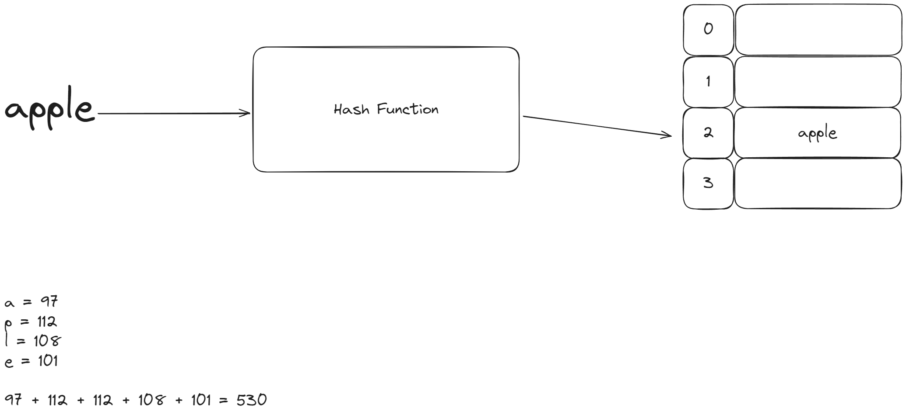
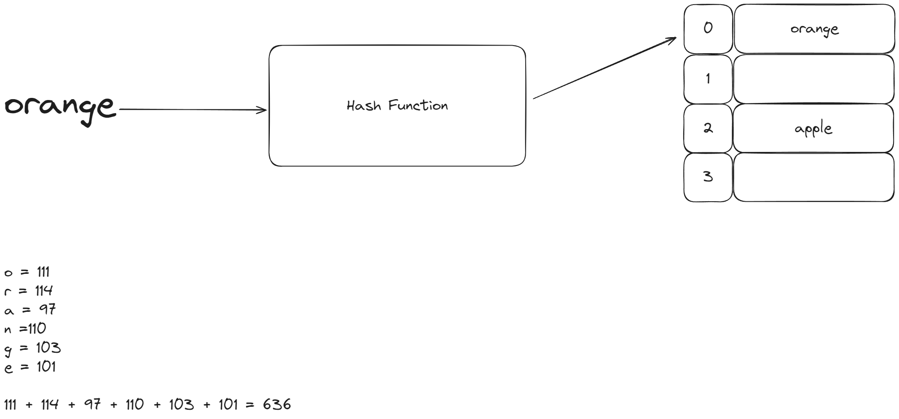
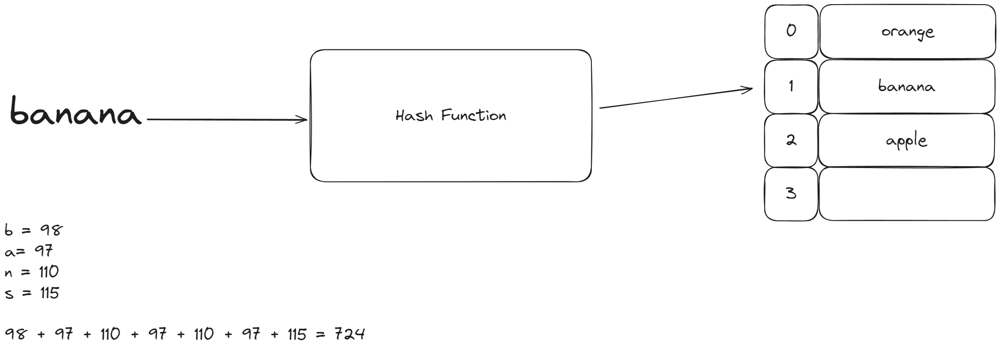
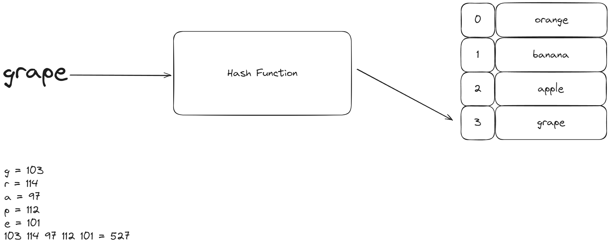

# Chapter 6 Hashing 
## 6.1 Introduction 
We’ve looked at lists and arrays and saw how useful they are at storing collections of related data, but while looking at complexity, we saw that a lot of operations for lists and arrays are performed at an O(n) time complexity which is not ideal for some situations.

Hashing data structures are built on top of linear data structures and make operations like reading, writing and deleting a lot more efficient, offering a constant time complexity for each of these operations.

You might be familiar with dictionaries and sets in Python, these are two examples of how hashing algorithms are implemented in code, but we will be diving a bit deeper and understanding how we can create our own hashing data structures so that we can answer interview questions on this topic.
## 6.2 Revisiting Linear Data Structures 
There are two data structures that we commonly use when we want to store data, the list and the array. The two are often incorrectly used interchangeably, but there are fundamental differences between the two.

### 6.2.1 Arrays 
An array stores an ordered collection of values, when we declare an array, we need to specify the max size of the array and the data type of the values that we are going to be storing. 

We cannot add or remove items from our array, we can only reference and update the indexes. If we were to declare an array of integers with a length of 5, it could be visually represented like this:

| Index | Value |     |
| ----- | ----- | --- |
| 0     | 0     |     |
| 1     | 0     |     |
| 2     | 0     |     |
| 3     | 0     |     |
| 4     | 0     |     |
Python does not support the array, but it's important to know about it as it is part of many other languages and will be key to how we perform hashing.

We can take a look at how an array would be implemented in C# just as a reference
```c#
public void main(string[] args)
{
	int[] numbers = int[10]; // Declaring an array of integers of size 10

	numbers[0] = 10; // setting the value of the first index to 10
	WriteLine(number[1].ToString()); // returns 0, primitive values can't be null
}
```

### 6.2.2 List 
A list can be defined as a dynamic array. Unlike an array, we don't need to declare the max size of our list when we create the object, the list will grow and shrink as we add and remove items.

The dynamic nature of the list is good as it allows us to work on problems where we don't know the total number of values that we are going to work with, this removes the overhead that might come with allocating a lot of space to an array and not using all of the preallocated spaces.

```python 
my_list = []
my_list.append("1")
my_list.append("2")
my_list.append("3")
my_list.append("4")

print(my_list[2]) # returns 3
```

### 6.2.3 Accessing Values
Arrays and lists can be very efficient at some operations. Inserting values into a list can be an O(1) operation if we are adding values to the end of the list, deletes can also be O(1) when we are removing from the end of the list. These operations are constant because we don't have to shift the values that come after when we do an insert or delete.

Another operation that is constant time for both arrays and lists, is getting a specific value at a given index, this will always be an O(1) operation.

So we can see that there are a few ways to get values at a constant time complexity with these two data structures, but we can also see that the conditions need to be perfect in order for us to use these efficiencies. What if we wanted to delete an item in the 4th position in a list of 10000 items, we would need to shift the remaining 9996 items one place up. 

Now imagine that we are looking for a specific value to delete, assuming our list is not ordered, we would firstly need to search for it, which would be O(n), and then deleting it would be another O(n), so ultimately, if we used the RAM model to evaluate the algorithm, we would find that the fastest growing term would be 2n.
## 6.3 What is a Hashing Data Structure 
It turns out that there is a way for us to make working with linear data structures more efficient. When we were talking about the fast operations of an array and list, we mentioned that getting a value at a specific index will always be O(1), but the problem with this is that we would need to know the index of the value that looking for, so we will end up working with an O(n) search in order to make use of the O(1) access.

This is where hashing comes in. Hashing takes a value, performs some operations on the value and returns an index where the value can be stored in an array.

This hashing operations basically serves as our search, but since it will be some constant time calculation to find the index, we will have an O(1) search before being able to make use of the O(1) access of the array.

### 6.4 Creating a hashing data structure 
A hashing data structure is made up of two main parts, the internal array that will store the values and the hash function that is responsible for transforming the value into an index before it can be stored in the internal array.

#### 6.4.1 Internal Array 
In most cases, we will use an actual array of a fixed size as our internal array, this is important as part of our hash function, we need to consider the maximum size of the array so that we can get indexes that will fall into our array size, we don't want to have a situation where we get an index of 20 in an array of 10 items.

#### 6.4.2 Hash Function 
This is the function that will convert our value into an index for the internal array. The algorithm that is used for the hash is up to you as the programmer, but the final output should be an integer that can be used to reference the internal array.

#### 6.4.3 Implementing a Hashing Data Structure 
The first steps to creating a hashing data structure is creating the internal array and determining our strategy for hashing our inputs.

#### 6.4.3.1 Simple Hashing
Given the following list of string values, ["apple", "orange", "banana", "grape"], we can take the following approach to hash them.

1. Create an internal array of size 4
2. Knowing that we need to generate a number from the strings in our hash function, get the ASCII value of each character and perform a calculation from there (yes technically this will be O(n), but there are other more advanced techniques for hashing strings, we will pretend like this is efficient for this example).

[ASCII TABLE](https://www.asciitable.com/) 


- Get the input value 
- Add up the ASCII values of each character 
	- a = 97, p = 112, l = 108, e = 101
	- 97 + 112 + 112 + 108 + 101  = 530
- Use the modulo operator on the sum of the characters
	- 530%4 = 2
- The result will be the index in our array
- insert the value to the index in the array

We can carry on the same process for the rest of the items:







#### 6.4.4 Handling Collisions
As you can imagine, there will be a point where the value we get from our hash function has already been taken in our internal array, this is referred to as a hash collision.

A hash collision occurs when two or more values return the same result from our hashing function. Finding an algorithm that minimises the chances of a hash collision is the biggest challenge that you will encounter when building a hashing data structure from scratch, it's important that you know the values that might be stored as this can guide you in creating your function.

Another technique that would help reduce hash collisions would be to increase the size of the internal array, as we saw previously, we will use use the modulo operator against the length of the internal array. If we increase the size of the internal array, we are reducing the chances of two values landing on the same spot.

Although we can minimise the chances of hash collisions, we can never be 100% sure that our algorithm completely rules out the possibility of collisions taking place, for this reason, we need to put measures in place to make sure that collisions are resolved.

To resolve collisions, there are two main approaches that we can take, Open Addressing and Closed Addressing.

#### 6.4.4.1 Open Addressing (Closed Hashing)
With open addressing, when we have a collision, we will look for another open lot within our internal array using some approach.

Some common approaches for open addressing include:
- Linear Probing 
- Quadratic Probing 
- Double Hashing 

Linear probing is the most popular approach and it involves finding the next open slot to the right of where there is a collision. 

![[Pasted image 20240601154738.png]]
If we get to a point where there are no values to the right, we will wrap around to the start of the array and find an open slot from there.

**Pros of Open Addressing**
- We are able to use up all of the open memory slots in our internal array

**Cons of Open Addressing**
- If two values collide early, one of them will take the position of another value, leading to a higher possibility of further collisions.

#### 6.4.4.2 Closed Addressing (Open Hashing)
This approach is often referred to as chaining, the process involves storing any values that have collisions within a list (typically a linked list) at their correct index. Unlike Closed addressing, chaining guarantees that the values will be at their correct index in the internal array.

![[Pasted image 20240601155938.png]]

**Pros of Closed Addressing**
It reduces the possibility of having cascading collisions as every value will be at it's correct index in the internal array.

**Cons**
This approach will use more memory than open addressing as a new object is created every time there is a collision. It will also result in a lot of open slots in our internal array 


#### 6.4.5 Memory Allocation 
Since we are working with a fixed size internal array, we are likely to run out of free slots within our internal array especially when we are working with open addressing, we need a way to handle this.

To make sure that our hash data structure never runs out of open slots, we can resize the array. Before we go any further, you might be thinking that this is the point where we bring lists into the equation, but the truth is that lists have no real place in hashing data structures. Because we are not able to manually set an index when we add a value, the list would not be feasible.

##### 6.4.5.1 Loading Factor
When resizing our array, we usually include an attribute known as the loading factor, the loading factor is a value between 0 - 1 that will let us know when to resize our array based on the percentage of space being used.

##### 6.4.5.2 Resizing 
Resizing an array can be an intense process, if you think back to the algorithm being used, it's dependent on the size of the array, changing the size of our array will mean that the old hashes would be wrong, so we would need to rehash all of the values so that they can be correct in the resized array.

We can resize our arrays when the percentage of slots in use are equal to or greater than the loading factor.
##### 6.4.5.3 Open Addressing vs Closed Addressing 
As you can imagine, we are more likely to run into situations where we need to resize our array when working with open addressing, unlike closed addressing where we can continue adding values even if we have run out of open slots, open addressing demands that a new array be created.

But keep in mind that not resizing a closed addressing approach would result in a lot of O(n) operations.

### 6.5 Findings
If you have been thinking about the time complexity of a hash table or hash set being O(1) throughout this chapter, you might be a little bit confused as to how a data structure that can potentially have O(n) operations is considered O(1)?

The truth about hashing data structures is that they have an average case complexity of O(1), so most of the operations that are performed will be O(1), but there is a worst case of O(n) when we run into collisions, and when we need to resize the array. 

We generally use the average case in this instance since a good algorithm will heavily reduce the number of collisions that might occur.

#### 6.5.1 Creating a Hashing Data Structure 
Lets take a look at how can create our own hashing data structure using linear probing.

*For the examples, we will be creating a hash set, to create a hash table, you would just need to take in an additional argument as the value to be stored alongside the key (can you store the values in a tuple within the array)*
```python
class HashSet:
    def __init__(self, size: int, load_factor: float) -> None:
        self.__size = size
        self.__filled_spaces = 0
        self.__load_factor = 1 if load_factor > 1 else load_factor
        self.__internal_array = [None] * size

    def add(self, value: str):
        self.__resize_array()

        index = hash
        self.__internal_array[index] = value    
        self.__filled_spaces += 1


    def __resize_array(self):
        filled_percentage = self.__filled_spaces / self.__size

        if filled_percentage < self.__load_factor:
            return 
        
        old_values = [value for value in self.__internal_array if value is not None]

        self.__size = self.__size * 2        
        self.__internal_array = [None] * self.__size

        for value in old_values:
            self.add(value)

    def contains(self, value: str):
        index = self.__hash(value)
        index = self.__linear_probing_search(index, value)
        return index > -1

    def __linear_probing_search(self, index, value, count=0):
        if self.__internal_array[index] == value:
            return index
        
        if count == self.__size:
            return -1
        
        if index == self.__size - 1:
            index = -1

        return self.__linear_probing_search(index + 1, value, count + 1)


    def __hash(self, value: str):
        ascii_values = sum([ord(char) for char in value])               
        return ascii_values % self.__size
    
    def __linear_probing_insertion(self, index):        
        if self.__internal_array[index] is None:
            return index 
            
        print("colision")

        if (index == self.__size - 1):
            index = -1

        return self.__linear_probing_insertion(index + 1)


    
    def print_internal_array(self):
        return print(self.__internal_array)
```

## 6.6 Further Reading and Resources
1. Additional learning
 - [CS3 Data Structures and Algorithms - OpenDSA](https://opendsa-server.cs.vt.edu/ODSA/Books/CS3/html/index.html)
 - [Introduction to Hash Tables and Dictionaries](https://www.youtube.com/watch?v=sfWyugl4JWA)

2. Online Courses
- "Algorithms, Part I" and "Algorithms, Part II" by Princeton University on Coursera 🎓
- "Data Structures and Algorithms" Specialization by University of California San Diego on Coursera 🎓
- "Algorithms and Data Structures" by MIT OpenCourseWare 🎓

3. Websites and Blogs
- [GeeksforGeeks](https://www.geeksforgeeks.org/)🌐
- [LeetCode](https://leetcode.com/)💻
- [HackerRank](https://www.hackerrank.com/)💻
- [The Algorithms - Python](https://github.com/TheAlgorithms/Python) 🐍

These resources offer in-depth explanations, coding examples, and practice problems to help you further enhance your understanding of computational complexity and algorithm optimization. 📚

Remember, the field of algorithms is vast and constantly evolving. Keep exploring, learning, and challenging yourself to become a proficient and efficient problem solver. 🌟

Happy learning, and may your algorithms be forever optimal! 😄
